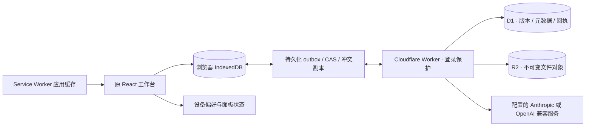

# Lattiora 网页架构

原 React 19 工作台继续作为产品界面，Dockview 管理 PDF、Markdown、源文件、白板、思维导图、Kanban、论文库及科研图谱/语义检索面板。思维导图与 Kanban 使用独立 JSON 文件及原文本面板保存/刷新契约，详见[可视化文档](frontend/visual-documents.md)。Host 已迁移到浏览器持久化和 Cloudflare。桌面安装包、Rust crate、CLI、ACP 进程和原生更新器已从本分支删除。

## 数据和一致性

`src/lib/cloud/files.ts` 为原文件 API 提供真实 Blob 存储；`db.ts` 将文件、待发请求、游标置于同一 IndexedDB 事务。文件先保存到本机再异步同步。Web Locks 保证同源多标签页串行修改，BroadcastChannel 通知其他标签页。拒绝缺少 Web Locks 的环境，不使用不安全的锁替代。

目录也是文件记录（inode/directory）；删除使用 tombstone。每论文 `.paper.json` 替代共享本地 catalog.sqlite，笔记、PDF、批注和对话都是独立同步文件。论文列表从本地 metadata 派生，离线可用。UI 排序、主题、工作区面板布局存于本地设备偏好，不做多人协作。首页组件布局和背景例外，以 `.agentero/home/` 普通文件跨设备同步。

Worker 通过版本条件更新 D1，产生递增变更序号；客户端上传携带 mutation UUID，成功回执持久化，丢失响应的重试不会重复提交。发出请求后再次编辑的内容不会被旧响应清除。拉取验证目标版本，遇到冲突保留完整副本与说明。恢复区 `Conflicts/` 从文件树与搜索隐藏，用户在同步设置中比较/处理，原版本归档后继续同步与备份，见[冲突副本管理](frontend/web-conflicts.md)。工作区 UUID 防止旧浏览器把本地数据直接推到替换过的空数据库。

R2 对象键不可变，上传重试校验内容；文件记录发布前先完成对象上传。覆盖/删除留下历史对象；自动垃圾回收尚未实现。移动与内部链接修复在本地一起提交，跨设备通过逐文件版本同步，可能短暂出现中间状态。

## 离线与安全

构建插件生成版本化 Service Worker，缓存整个应用资源集（含懒加载编辑器和 PDFium WASM）；API 不进入 HTTP Cache。缓存完成并首次登录过的可信设备可离线启动。更新等待旧页面退出，不强制 reload。

API 使用 HMAC 签名 HttpOnly / SameSite=Strict / HTTPS Secure cookie；写请求检查 Origin，登录受限速器保护。密码和 AES-GCM 主密钥放 Workers Secrets。模型配置以密文存 D1，公有静态资产不含秘密。模型 key 不存到客户端或备份。文件不做端到端加密，退出只锁定界面，本机副本仍受浏览器/操作系统账号保护。

链接分享将主笔记和用户显式选中的直接关联笔记保存为带版本号的 Markdown JSON 快照，接收页独立渲染并只在快照内导航。既有 PDF/PNG/原文链接保持兼容。快照保存为独立 R2 `shares/<id>` 对象，D1 `shares` 记录随机 ID、来源路径、格式、到期与关闭状态及 PBKDF2 密钥哈希。仅 `/api/public-shares/<id>` 允许匿名检查/读取；密钥尝试按 IP 限速，读取前检查有效性，响应不缓存。分享页在工作区初始化前分流，不读取本机资料。创建/列出/关闭使用原会话与 Origin 检查，关闭先更新 D1 再删除 R2。分享记录不参与文件 outbox 或工作区 ZIP，见[链接分享](frontend/web-sharing.md)。

## 代码入口

| 层 | 入口 |
|---|---|
| 原工作台布局与面板 | src/App.tsx、src/components/workspace/ |
| 原 PDF 阅读/批注 | src/components/viewer/pdf/、src/lib/pdf/ |
| 原 Markdown 编辑 | src/components/editor/、src/lib/markdown/ |
| 网页登录、工具栏、统一 AI | src/components/cloud/ |
| 浏览器文件、论文 metadata、同步与备份 | src/lib/cloud/ |
| 旧 UI 的类型契约边界 | src/lib/core/bindings.ts → src/lib/cloud/commands.ts |
| 云 API / 数据库迁移 / 离线构建 | cloudflare/ |

遗留类型名称保留以减少对原 UI 的改写；未实现的 native command 明确报错，不返回伪成功。完整能力差异见 [迁移清单](deployment/capabilities.md)，部署和恢复见 [操作说明](deployment/cloudflare.md)。历史 bug 复盘保留在 docs/bug_fix/，其中桌面结论不作为网页运行说明。

## 科研视图与阅读记录

关系图谱从论文 metadata、Markdown 双链和既有引文 sidecar 派生。语义索引 `.agentero/search/` 记录来源 revision 并复用推荐向量缓存；新内容/查询通过已有 Embedding 代理，既有索引可被 Agent 的 `semantic_search` 查询。无独立向量数据库，来源更新后旧索引失效，见 [科研检索](frontend/web-research.md)。

实际阅读页在论文 `.reading/` 按设备独立写入，同步后按 PDF mutation ID 合并页集合，AI 分析完成时间独立保存。首页与 Library 共用这份派生进度，批注热力图保持原语义，见 [阅读记录](frontend/web-reading-heatmap.md)。天气使用登录保护的固定 Open-Meteo 代理，无客户端 Key；支持手动选择城市或用户点击后通过浏览器授权获取一次位置，经纬度保留两位小数并按现有首页设置同步，不持续追踪。静态页 Permissions-Policy 允许本站请求定位，详见 [首页](frontend/web-home.md)。
